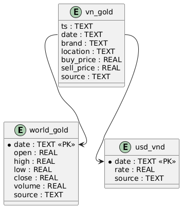

📄 README.md


# Gold AI Advisor


Gold AI Advisor is a system built with **Flask + SQLite + Python scripts** to crawl, store, and analyze gold prices (Vietnam + World).

It includes a simple **Admin Web UI** for managing, filtering, and updating daily gold price data.


---


## ✨ Features

- 🪙 Crawl Vietnam gold prices (**SJC, PNJ, DOJI**) via CafeF endpoints.

- 🌍 Fetch world gold (GC=F) and USD/VND exchange rate via Yahoo Finance.

- 💾 Store everything in **SQLite** (`data/gold.db`).

- 🖥 Admin Web UI:

- Pagination (50 rows/page).

- Filter by **Brand** (SJC, PNJ, DOJI).

- Search by keyword.

- Sort ascending/descending.

- 📆 Daily update endpoint with alert/confirmation.

- ♻️ Auto-prune data to last **365 days** (to avoid DB bloat).

- 🗂 Deleted rows are exported to CSV backup before being removed.


---


## ⚙️ Requirements

- Python **3.9+** (tested with 3.13).

- pip + venv.

- Git.

- (Optional) Makefile for easier commands.


---


## 🚀 Setup Guide


### 1. Clone the repository

```bash

git clone https://github.com/<your-username>/gold-ai-advisor.git

cd gold-ai-advisor

```


### 2. Setup Virtual Environment


On Mac/Linux:

```bash

python3 -m venv .venv

source .venv/bin/activate

```

On Windows (PowerShell):

```powershell

python -m venv .venv

.venv\Scripts\activate

```


### 3. Install dependencies

```bash

pip install --upgrade pip

pip install -r requirements.txt

```


### 4. Initialize Database

```bash

make init

```


### 5. Fetch Initial Data


World gold + USD/VND:

```bash

make world

```


Vietnam gold:

```bash

make vn-all

```


### 6. Run the Backend


Mac/Linux:

```bash

make backend

```


Windows (PowerShell):

```powershell

set FLASK_APP=backend/wsgi.py

set FLASK_ENV=development

python -m flask run --host=0.0.0.0 -p 8000

```


👉 Now open: http://127.0.0.1:8000/admin/vn


⸻


🗂 Project Structure


gold-ai-advisor/

├── backend/

│ ├── routes/ # Flask blueprints (admin, api)

│ ├── templates/ # HTML templates (Jinja2)

│ ├── static/ # CSS, JS, assets

│ ├── db.py # SQLite helpers

│ ├── wsgi.py # Flask entrypoint

│ └── app.py # App factory

├── scripts/

│ ├── ingest_world_fx_3m.py # World gold + USD/VND ingestion

│ ├── import_vn_from_json.py # Import VN JSON into DB

│ └── vendors/

│ └── gold_price_focused_crawler.py

├── data/ # SQLite DB + backups (ignored by git)

├── requirements.txt

├── Makefile

└── README.md


⸻


🛠 Makefile Commands

• make init → Create schema.

• make world → Ingest world gold + FX.

• make vn-crawl → Crawl VN gold (raw JSON).

• make vn-import → Import VN JSON into DB.

• make vn-all → Crawl + import VN gold.

• make reset → Reset DB, reload all data.

• make backend → Run Flask backend on port 8000.


⸻


🔔 Daily Update

• Update via Makefile:


```bash

make world

make vn-all

```


• Or via web endpoint: http://127.0.0.1:8000/admin/update


System will:

1. Confirm if you’re about to delete old data.

2. Insert new daily rows.

3. Export deleted rows into data/deleted_*.csv.


⸻


📌 Notes

• Data retention: last 365 days only.

• Deleted rows stored safely in CSV backup.

• Updates should run once a day.


⸻


## 📊 Database Schema


Below are the **actual** tables and columns used by the SQLite database (`data/gold.db`).

These match `scripts/create_schema.py` and all backend queries.


### Table: `world_gold`

| Column | Type | Meaning |

|---|---|---|

| `date` | TEXT (PK) | Trading date (YYYY-MM-DD) |

| `open` | REAL | Opening price (USD/oz) |

| `high` | REAL | Highest price (USD/oz) |

| `low` | REAL | Lowest price (USD/oz) |

| `close`| REAL | Closing price (USD/oz) |

| `volume` | REAL | Trading volume (may be 0 / NULL for futures) |

| `source` | TEXT | Data origin (e.g. `yfinance`) |


### Table: `usd_vnd`

| Column | Type | Meaning |

|---|---|---|

| `date` | TEXT (PK) | Trading date (YYYY-MM-DD) |

| `rate` | REAL | USD/VND close rate (VND per 1 USD) |

| `source` | TEXT | Data origin (e.g. `yfinance`) |


### Table: `vn_gold`

| Column | Type | Meaning |

|---|---|---|

| `ts` | TEXT | ISO timestamp of the quote (e.g. `2025-08-22T10:15:00`) |

| `date` | TEXT | Quote date (YYYY-MM-DD) — for fast filtering/pagination |

| `brand` | TEXT | Gold brand (e.g. `SJC`, `PNJ`, `DOJI`) |

| `location` | TEXT | Optional store/city/region (can be empty) |

| `buy_price` | REAL | Buy price in **VND per lượng** |

| `sell_price` | REAL | Sell price in **VND per lượng** |

| `source` | TEXT | Data origin (e.g. `cafef`, `pnj`, etc.) |


> Indexes in use: `idx_vn_gold_date` (on `date`) and `idx_vn_gold_brand` (on `brand`) to speed up filtering & pagination.

⸻


## 🗺 ERD Diagram (PlantUML)


## 🗺 ERD Diagram





📜 License

	•	Admin pages (Flask):
	•	VN: http://127.0.0.1:8000/admin/vn
	•	World: http://127.0.0.1:8000/admin/world
	•	FX: http://127.0.0.1:8000/admin/fx
	•	Dash EDA (Plotly):
	•	trực tiếp: http://127.0.0.1:8000/dash/
	•	hoặc embed trong Admin: http://127.0.0.1:8000/admin/dash

MIT

🔹 Brands
	•	Lets you filter by brand (e.g., PNJ, SJC, DOJI…).
	•	When you select a brand, only its data will be shown in the charts.
	•	You can select multiple brands at once.

⸻

🔹 Scale
	•	Linear: The y-axis (gold prices) is displayed in a normal linear scale.
	•	Log: The y-axis is displayed in a logarithmic scale → useful when price differences between brands are very large (e.g., SJC ≈ 120M vs PNJ ≈ 5M).

⸻

🔹 Normalize (Rebase to 100)
	•	When enabled, all series are rebased to 100 at the starting date.
	•	Helps compare relative growth instead of absolute values.
	•	Example: If PNJ goes from 100 → 120, that’s a 20% increase;
If SJC goes from 100 → 105, that’s a 5% increase.

⸻

🔹 Smoothing (days)
	•	Applies a moving average (rolling mean) to smooth the data.
	•	Example: Smoothing = 3 → each point is the average of the last 3 days.
	•	Useful to remove noise (spikes) and highlight long-term trends.

⸻

🔹 Outliers (Remove by IQR)
	•	When enabled, applies Interquartile Range (IQR) filtering to remove outliers.
	•	Outliers are extreme “spikes” (too high/low) often caused by crawl errors.
	•	This makes the chart cleaner and easier to interpret.